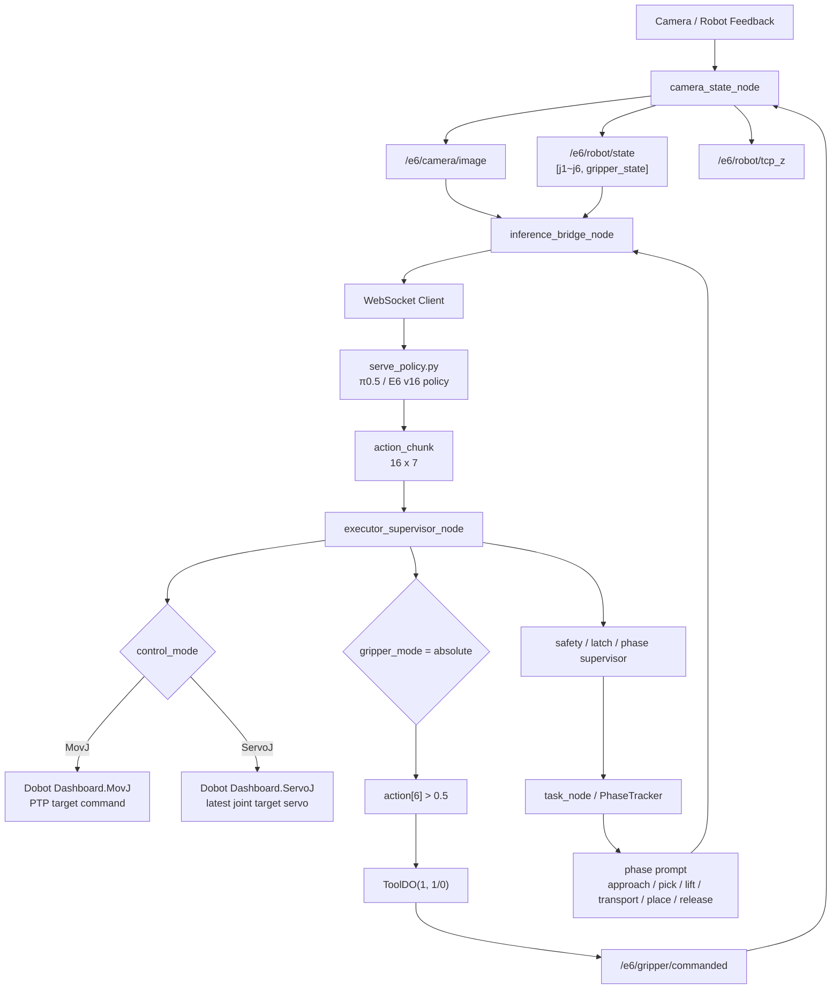
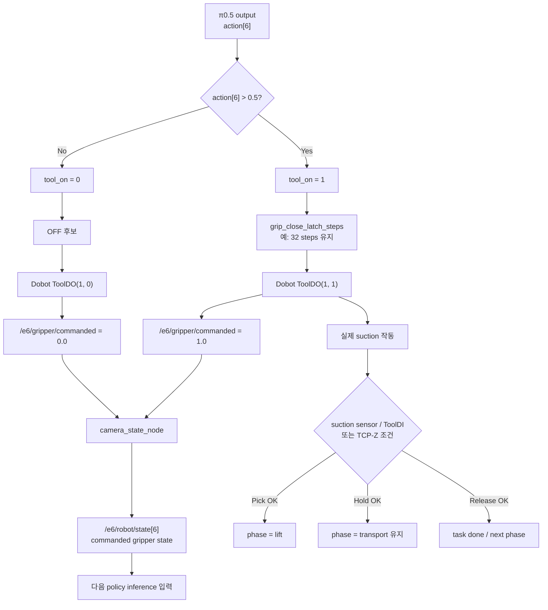
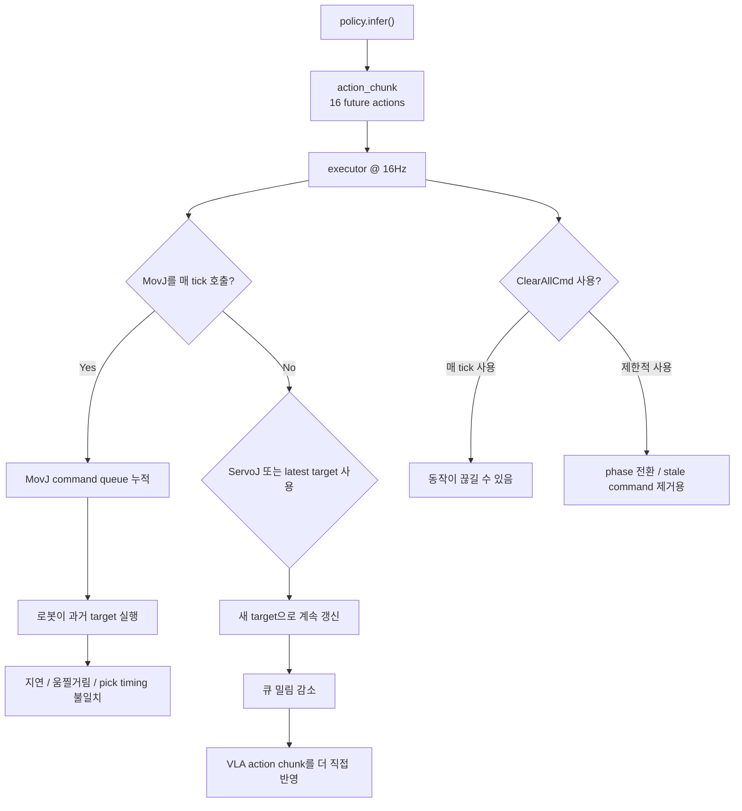

# π0.5 E6 추론 파이프라인 실험 노트

핵심: **π0.5 추론 결과가 곧 로봇 동작이 아니라, executor가 Dobot 명령으로 변환하고
gripper/state/phase를 다시 닫아주는 폐루프 구조**이다.

v16/v17은 `action_mode=delta`, `gripper_mode=absolute`, `prompt_mode=per_frame_v16`,
`state=7D` 구조로 정리되어 있고, `ToolDO(1,1)` 호출은 정상이나 gripper 상태 피드백을
`/e6/gripper/commanded`로 보정한 흐름이 확인된다.

---

## 1. 전체 추론 실행 파이프라인



---

## 2. Gripper absolute + commanded state 보정 구조



---

## 3. 왜 ServoJ 또는 latest-command 방식이 필요한가



---

## 4. 실험 노트

본 실험의 π0.5 추론 구조는 policy가 action chunk를 직접 로봇에 실행하는 방식이 아니라,
inference_bridge_node가 image/state/prompt를 policy server로 전달하고,
executor_supervisor_node가 반환된 16x7 action chunk를 Dobot TCP 명령으로 변환하는 구조이다.

v16/v17에서는 joint action은 delta로, gripper action은 absolute로 해석한다.
따라서 action[0:6]은 현재 joint에 더해 target joint를 만들고,
action[6]은 threshold를 통해 ToolDO(1,1/0) 명령으로 변환한다.

기존에는 camera_state_node가 DigitalOutputs bit를 직접 읽어 gripper state를 구성했지만,
ToolDO 상태가 해당 bit에 안정적으로 반영되지 않아 state[6]이 계속 0으로 유지되는 문제가 있었다.
이를 해결하기 위해 executor_supervisor_node가 ToolDO 명령과 동시에
/e6/gripper/commanded 토픽을 발행하고, camera_state_node가 이를 구독하여
다음 inference 입력의 gripper state로 사용하도록 수정하였다.

또한 MovJ를 16Hz로 반복 호출하면 Dobot 내부 명령 큐가 밀려 과거 target을 실행할 수 있으므로,
실시간 action chunk 실행에는 ServoJ 또는 latest-command 기반 실행 방식이 더 적합하다.
ClearAllCmd는 매 tick 사용하기보다 phase 전환, stale command 제거, 비상 상황에서 제한적으로 사용하는 것이 적절하다.

---

## 5. 한 줄 요약

π0.5는 action chunk를 생성하고, executor_supervisor_node는 이를 Dobot 명령으로 변환한다.
따라서 추론 성능은 모델 출력뿐 아니라 MovJ/ServoJ 실행 방식, gripper latch,
commanded gripper state, suction sensor 기반 phase 전환까지 포함한 runtime control loop에 의해 결정된다.

---

## 6. control_mode 실행 예시

```bash
# 기존 방식 (MovJ, 기본값)
ros2 launch e6_vla_ros e6_vla.launch.py \
  action_mode:=delta \
  gripper_mode:=absolute \
  prompt_mode:=single \
  prompt_text:='pick up the orange box from the left side and place it on the right side' \
  min_tool_z:=75.0 \
  grip_enable_z:=125.0 \
  grasp_z_max:=130.0 \
  min_hold_frames:=16 \
  pick_prearm_z:=159.0 \
  scripted_lift_enabled:=true \
  scripted_lift_target_z:=185.0 \
  scripted_lift_wait_frames:=48 \
  scripted_lift_stall_z:=160.0 \
  max_steps:=3000 \
  place_force_release_enabled:=true \
  place_z_threshold:=110.0

# ServoJ 실험
ros2 launch e6_vla_ros e6_vla.launch.py \
  action_mode:=delta \
  gripper_mode:=absolute \
  prompt_mode:=single \
  prompt_text:='pick up the orange box from the left side and place it on the right side' \
  min_tool_z:=75.0 \
  grip_enable_z:=125.0 \
  grasp_z_max:=130.0 \
  min_hold_frames:=16 \
  pick_prearm_z:=159.0 \
  scripted_lift_enabled:=true \
  scripted_lift_target_z:=185.0 \
  scripted_lift_wait_frames:=48 \
  scripted_lift_stall_z:=160.0 \
  max_steps:=3000 \
  place_force_release_enabled:=true \
  place_z_threshold:=110.0 \
  control_mode:=servoj

# ServoJ + 주기 튜닝 (executor_hz=16 → t=0.0625s)
ros2 launch e6_vla_ros e6_vla.launch.py \
  ... \
  control_mode:=servoj \
  servoj_t:=0.0625
```
